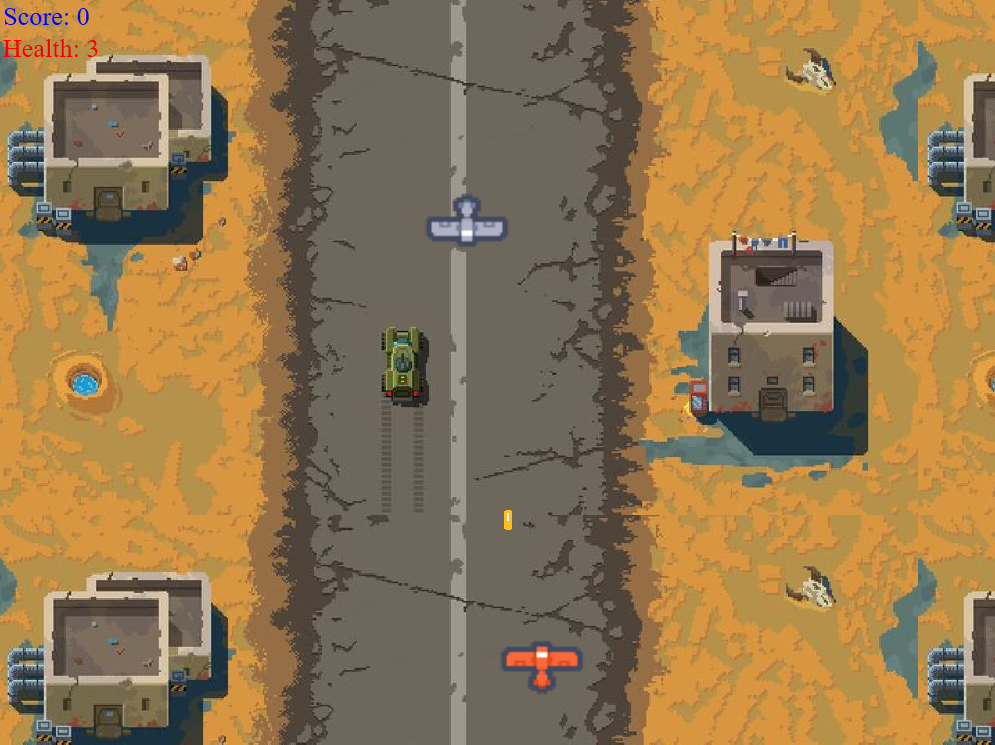

# QT Plane Game

Welcome to the **QT Plane Game**, a simple yet engaging 2D shooting game developed using C++ and the Qt framework. This project offers an interactive experience where players control a plane to navigate through enemies, aiming to achieve the highest score possible.

## Gameplay

## Features

- **Player Control**: Maneuver the player's plane using keyboard inputs.
- **Enemy Generation**: Dynamic spawning of enemy planes that challenge the player.
- **Shooting Mechanism**: Fire bullets to eliminate enemies.
- **Score Tracking**: Real-time display of the player's score.
- **Health Management**: Player health decreases upon enemy collision.
- **Background Music**: Immersive soundtrack to enhance gameplay.

## Source Files:

- **main.cpp**: Entry point of the application.
- **Game.cpp & Game.h**: Core game logic and scene management.
- **Player.cpp & Player.h**: Player plane implementation.
- **Enemy.cpp & Enemy.h**: Enemy plane behavior.
- **Bullet.cpp & Bullet.h**: Bullet mechanics.
- **Health.cpp & Health.h**: Player health tracking.
- **Score.cpp & Score.h**: Score management.
